一場猜拳實驗引發的時空旅行（誤
===

前言
---

最近在 FB 看到一篇貼文，在講述貧富差距就像 Maxwell–Boltzmann distribution 是自然產生的。[^facebook]

不過他不能給出公式並給出每個參數對應的影響，這對我而言不夠嚴謹，過早的下結論可能有問題。但是我要承認，還沒點進去之前，看到命題與曲線的第一個反應確實是想到 Maxwell–Boltzmann distribution，畢竟命名假設金錢守恆（能量守恆）、猜拳（粒子碰撞），跟該模型確實有幾分神似，並且我大學做報告的時候曾經引用過下面這張動畫，所以對曲線的趨勢有點印象。


**老實說我不在乎這個命題到底符不符合現實，我在意的是如何解釋猜拳遊戲的結果。**`(((°A° ≡ °Д°)))`

命題
---

首先讓我來看看命題：


為了不要讓資料有這麼多的 "0"，於是我稍微修改了一點參數：

- 初始值為 1000
- 每次交流量為 10

接著我寫了幾行程式跑跑看它的命題。

```javascript=
for (let i = 0; i < 100000000; i++) {
    let x = Math.floor(Math.random() * 1000),
        y = Math.floor(Math.random() * 1000);
    let w = Math.floor(Math.random() * 100);

    if (array[x] >= 10) {
      array[x] -= 10;
      array[y] += 10;
    }
}
```

跑出的結果如下，左圖是排序後每人資產值，右圖是分佈：

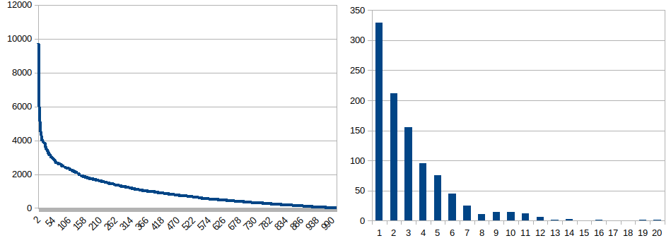

恩？怎麼沒使用決定猜拳輸贏的變數 `w` ？因為隨機抽出兩者，這個行為本身就自帶 50% 機率的輸贏了，總之這程式運作看起來沒問題。

### 簡化命題

先讓我們移除「金錢守恆」這個約束條件：

```javascript=
for (let i = 0; i < 100000000; i++) {
    let x = Math.floor(Math.random() * 1000);
    let z = Math.floor(Math.random() * 100);

    array[x] += (z >= 50) ? 10 : -10;
    if (array[x] < 0) {
        array[x] = 0;
    }
}
```

恩...「貧富差距」的情況好像比起前者緩和了點，不過趨勢大致符合，而且分佈似乎更符合文中提到的「真實世界」財富分佈呢？ [^power-point] `ლ(́°Д°ლ)`

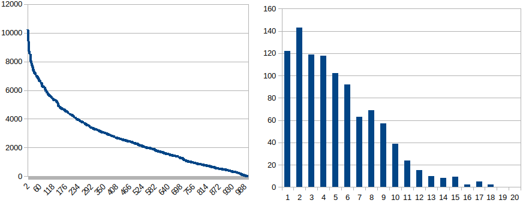

仔細觀察就可以發現，這個簡化過得命題的本質是一個伯努利過程：

- 成功獲得錢
- 失敗失去錢

伯努利過程
---

既然命題的本質是一堆伯努利試驗，那麼它的分佈應該就可以用二項式分佈近似常態分佈來描述，不過在那之前先讓我們跑跑幾個模型並觀察它們。

### 伯努利過程

左圖是每人成功次數一覽，右圖是分佈 0~1 分別代表 1000 人之中的最小值與最大值。

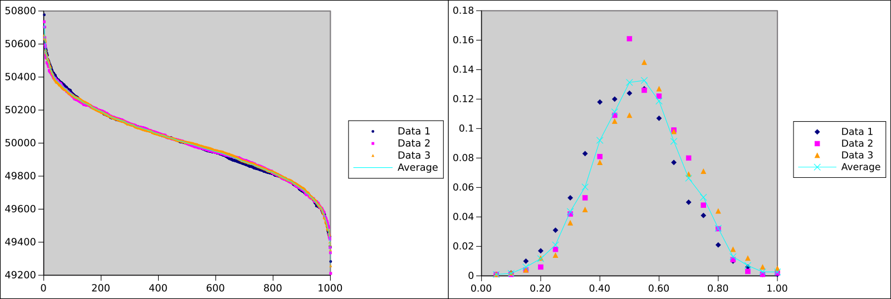

變數：

- 人數：1,000
- 平均每人試驗數：100,000

### 伯努利過程，但是失敗會扣分

同樣是伯努利過程，但是不是紀錄成功次數，而是採積分制，並且失敗了會扣分。

左圖是每人的點數一覽，右圖是分佈 0~1 分別代表 1000 人中積分的最小值與最大值。

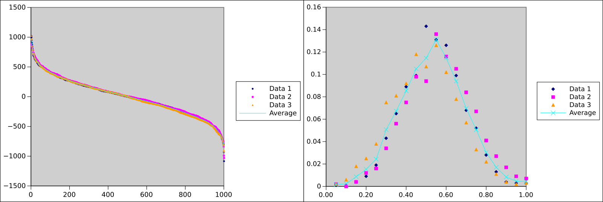

變數：

- 人數：1,000
- 平均每人試驗數：100,0000
- 初始積分: 0
- 每次積分增減額: 1

### 伯努利過程，但是會破產

同樣是積分制的白努力過程，只是積分歸零時不會繼續扣分，也就是破產。

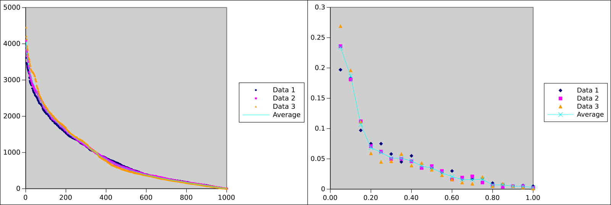

變數：

- 人數：1,000
- 平均每人試驗數：100,0000
- 初始積分: 0
- 每次積分增減額: 1

### 伯努利過程，但是會破產

基本上前者已經十分接近簡化後的命題（不考慮金錢守恆），但是沒有辦法使用數學模型處理，於是我想了一個模型，先來看看它是不是表現的跟會破產的伯努利過程差不多：

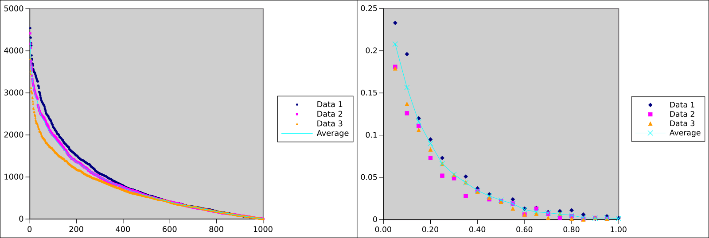

確認一下分佈模式：

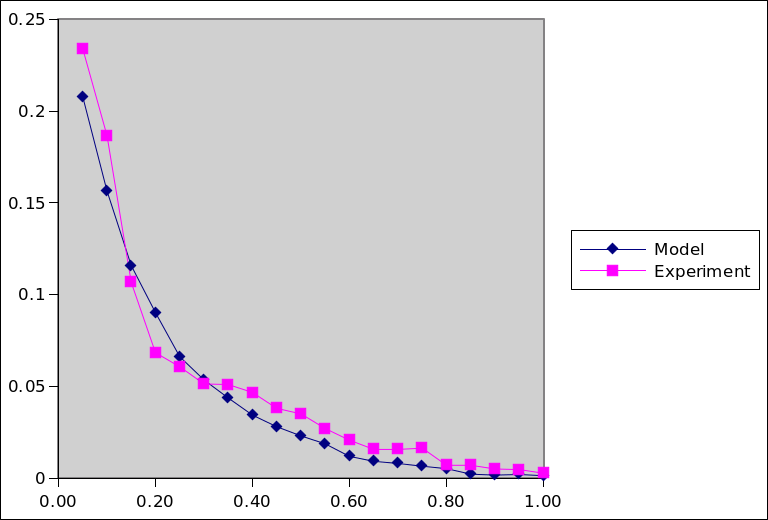

恩...感覺差不多...?

伯努利過程，~~但是時光旅行~~
---

### 若不考慮破產...

讓我們回憶一下那個沒有破產的美好世界（？）


可以發現它其實遵守常態分佈，而這個常態分佈可以用隨機漫步的公式描述[^random_walks]：

$$
p(x) = p_\mathcal{N}(0,n)
$$

其中 $n$ 為實驗次數。

### 『當局不承認資產為負』

接著我們來進行一個空想實驗，
首先我們看看不考慮破產，實驗結束時的積分一覽：

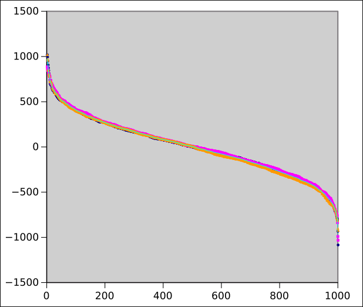

可是命題不准許積分為負，於是出現了一個 G-man 對著那些積分為負的人說道：「當局」不承認資產為負的結果，於是我們要把你們回朔回實驗進行到一半的時間點，並且統計上來說，你們的平均積分為 0，所以不論當時實際上的積分為多少，我都把你們的積分歸零。

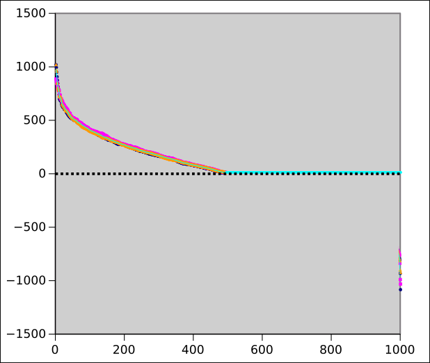

接著這群人便繼續跑完剩下的試驗：

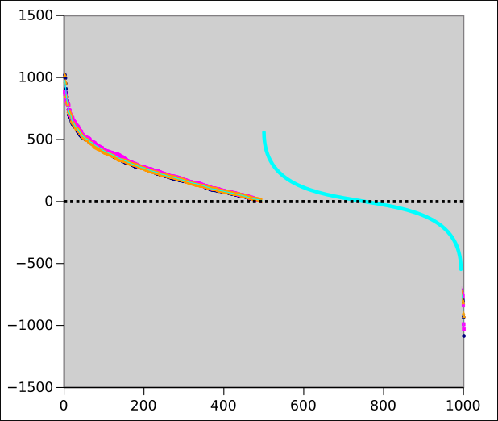

然後 G-man 又出現了，並對著那些負積分的人說道....

...

如此重複，直到沒有負積分的人出現。最後實驗完成了，「當局」透過無數次時間回朔，掩蓋了負積分發生過得事實。

### 分佈

根據空想實驗，我們知道了實驗的分佈其實就是這個一覽的分佈：

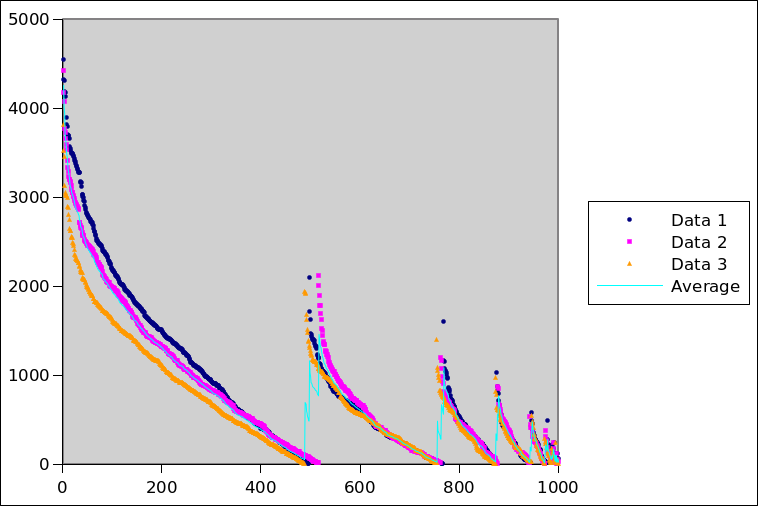

所以分佈應該會是一堆被截斷的常態分佈組成的：

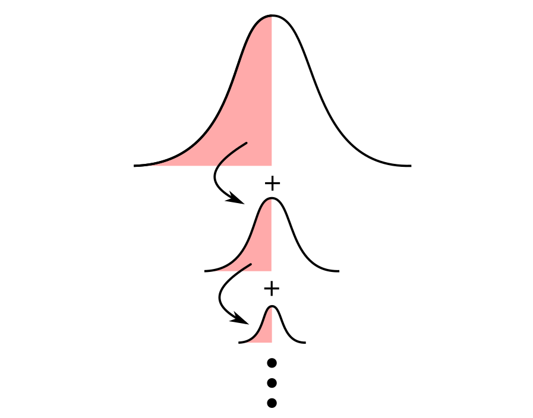

寫成公式的話：

$$
p(x) = \sum_{i=0}^{\infty} \frac1{2^i} \cdot p_\mathcal{N}(0,\frac{n}{2^i}) \Bigg| _{0 \le x}
$$

### 所以答案勒？

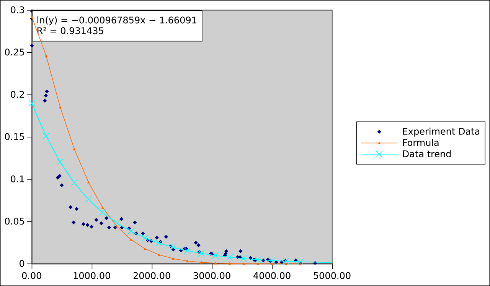

老實說還是有點不匹配...在高積分的時候會低估，低積分的分佈則是會高估...最後做出來的模型不能很好的匹配實驗結果...並別提實驗還是簡化過得版本。

把資料產生趨勢線轉成函數後再跟模型進行比較之後，根據誤差值計算評估模型準確性的指標，不是很理想`_(:3」∠)_`：

| 指標  | 值    |
| ----- | ----- |
| MAE%  | 47.8% |
| RMSE% | 79.2% |

但是做這個題目的過程中，有查一篇文章把它建模成隨機漫步並且給出了好像蠻準確的解析解，有興趣的人可以參考看看：[^post]

$$
f(q)=-\mu \log \left(1-\frac{q}{\text{N}}\right)
$$

- $f(q)$: 排序 $q$ 的資金期望值
- $\mu$: 起始資金
- $N$: 人數

[^facebook]: 《一堂物理課，了解貧富差距的根源》. (Liou YanTing). Retrieved 2020-10-11, from https://www.facebook.com/permalink.php?story_fbid=3403616276360627&id=100001368650813

[^power-point]: Retrieved 2020-10-11, from  https://onedrive.live.com/view.aspx?resid=CBFF5A71EA6FC91A!22293&ithint=file%2cpptx&authkey=!AOzyBQOwUjEUGFo

[^random_walks]: Chapter 7: Random walks | Mathematical Preparation for Finance. (Kaisa Taipale). Retrieved 2020-10-11, from https://www.softcover.io/read/bf34ea25/math_for_finance/random_walks

[^post]: 房间内有 100 人，每人有 100 块，每分钟随机给另一个人 1 块，最后这个房间内的财富分布怎样？ - 知乎, Retrieved 2020-10-11, from https://www.zhihu.com/question/62250384/answer/256130999

###### tags: `learning note` `2020-10-06`